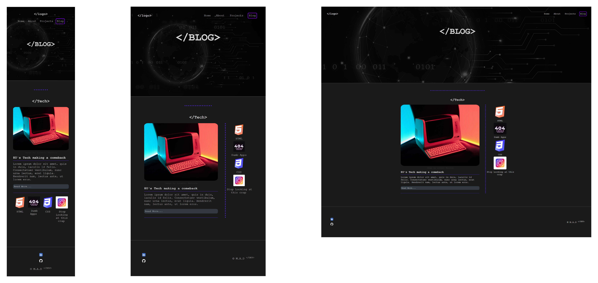

# **Coder Academy - T1A2 Portfolio**

 
Link: [GitHub Repo](https://github.com/SkimJazz/CA_T1A2_portfolio)

Link: [Website Portfolio](https://skimjazz.github.io/CA_T1A2_portfolio/)

Link: [Presentation](https://www.loom.com/share/b63b85cca1fe41c9b2d5648794a1deaa)
## **Purpose of this Website Portfolio**

The purpoes of this Website Portfolio is to demonstrate my skills and experience as an emerging Full Stack Developer. 

## **Contributors**

Joshua Bennett

## **Target Audience**

*   Tech Industry
*   Tech Investors
*   Web Development Companies
*   Tech Industy leaders
*   Education Industry
*   Tech Startups

## **Tech Stack**

*   HTML
*   CSS
*   Firefox - Web browser dev tools
*   GitHub - Repo containment
*   Lucidchart - Wireframing
*   GitHub Pages - Deployment

## **Sitemap**

## **Functionality / Features**

Multiple user interfaces where taken into account for the design of this Website Portfolio.

## **Functionality:**
### Moblie Phone

*   Designed with both Android and iOS in mind.
*   Lightweight content for responsive end user experiences.
*   Optimized for image quality to take advantage of modern displays.

### Tablet

*   Layout transitions to landscape mode to utilize additional screen space.
*   Content scales and flows on page on demand.

### Desktop

*   Use of negative blank space to draw attention to key elements and simplify message delivery.
*   Integrations with social media and email.
*   Tested for accessibility and screen readers (cascades to all views).

## **Features:**

### All Pages:
Some of the key features across all interfaces and pages for this website portfolio include:
*   A large header section with an embedded background picture positioned behind the navigation bar, logo, and main introduction to the website. The exaggerated header section was to bring attention to the main theme of the website.

*   The body of the pages consist of a Matte Black colour used to emphasise the icons of certain colours to draw attention to the skills and interests of the developer.

*   The Matte Black colour is consistent throughout the entire website portfolio. Pages such as Home, About, Projects, and Blog contain different accenting colours used to to help the user keep track of where they are on the website.

### Moblie View:

*   In mobile view the interface consists of standard section containers arranged in a column view.
### Tablet View:

*   The tablet view interface consists of section containers arranged in a column view. The larger screen size allowed for smaller containers to be added to reposition the icon end their related text in a row formation.

### Desktop View:

*   Transitioning from tablet to desktop view allows the website to take advantage of additional negative blank space, drawing in the users attention and directing it to the developers main attributes.

## **Screen Shots**

### Home Page

 

 

### About Page

 

 

### Projects Page

 

 

### Blog Page

 

 

